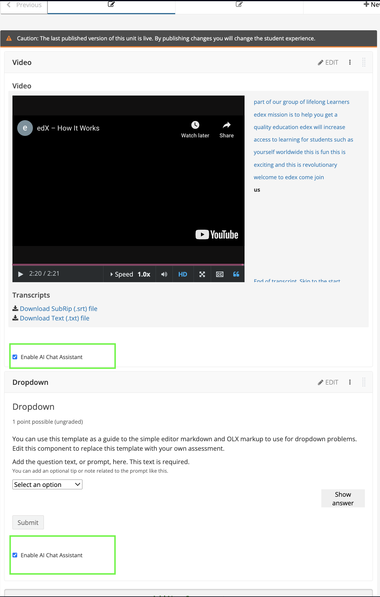
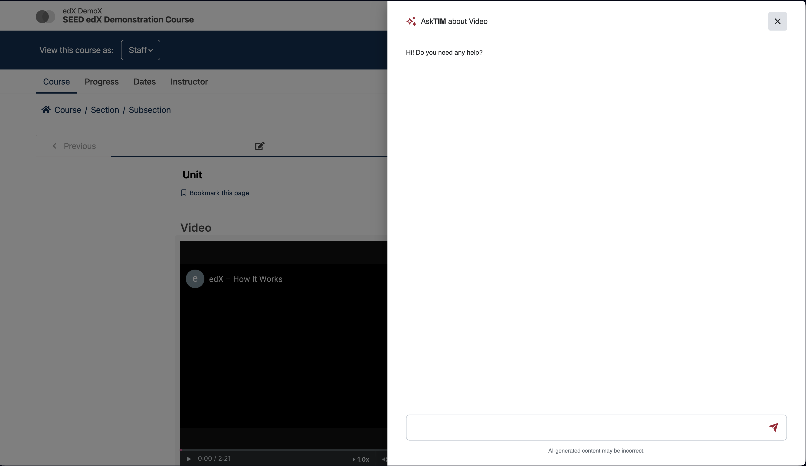

OL OpenedX Chat
###############

An xBlock aside to add MIT Open Learning chat into xBlocks.

Purpose
*******

MIT's AI chatbot for Open edX

Setup
=====

For detailed installation instructions, please refer to the `plugin installation guide <../../docs#installation-guide>`_.

Installation required in:

* LMS
* Studio (CMS)

Configuration
=============

1. edx-platform configuration
-----------------------------

- Add the following configuration values to the config file in Open edX. For any release after Juniper, that config file is ``/edx/etc/lms.yml``. If you're using ``private.py``, add these values to ``lms/envs/private.py``. These should be added to the top level. **Ask a fellow developer for these values.**

  .. code-block::

    MIT_LEARN_AI_API_URL: <MIT_LEARN_AI_API_URL>
    MIT_LEARN_API_BASE_URL: <MIT_LEARN_API_BASE_URL>
    MIT_LEARN_SUMMARY_FLASHCARD_URL: <MIT_LEARN_SUMMARY_FLASHCARD_URL>

- For Tutor installations, these values can also be managed through a `custom Tutor plugin <https://docs.tutor.edly.io/tutorials/plugin.html#plugin-development-tutorial>`_.

2. Add database record
----------------------

- Create a record for the ``XBlockAsidesConfig`` model (LMS admin URL: ``/admin/lms_xblock/xblockasidesconfig/``).

- Create a record in the ``StudioConfig`` model (CMS admin URL: ``/admin/xblock_config/studioconfig/``).

3. In frontend-app-learning, Run the below in the shell inside the learning MFE folder:
---------------------------------------------------------------------------------------
This will download the smoot-design package and copy the pre-bundled JS file to a location loadable by OpenEdx.

.. code-block:: sh

   npm pack @mitodl/smoot-design@^6.17.0
   tar -xvzf mitodl-smoot-design*.tgz
   mkdir -p public/static/smoot-design
   cp package/dist/bundles/* public/static/smoot-design

4. Create env.config.jsx in the frontend-app-learning and add the below code:

The Unit is rendered inside an Iframe and we use postMessage to communicate between the Iframe and the parent window. The below code is used to initialize the remoteAiChatDrawer.

.. code-block:: js

   import { getConfig } from '@edx/frontend-platform';
   import { getAuthenticatedHttpClient } from '@edx/frontend-platform/auth';

   import(
      /* webpackIgnore: true */
   "/static/smoot-design/aiDrawerManager.es.js").then(module => {
      module.init({
         messageOrigin: getConfig().LMS_BASE_URL,
         transformBody: messages => ({ message: messages[messages.length - 1].content }),
         getTrackingClient: getAuthenticatedHttpClient,
      })
   })

   const config = {
   ...process.env,
   };

   export default config;

(Alternatively, you can import the drawer code from a CDN like kg.com/@mitodl/smoot-design@6.4.0/dist/bundles/remoteTutorDrawer.umd.js to skip Step 3. However, the steps outlined here are most similar to what we do in production.)

5. Start learning MFE by ``npm run dev``
----------------------------------------
6. In LMS, enable the ``ol_openedx_chat.ol_openedx_chat_enabled`` waffle flag at ``<LMS>/admin/waffle/flag/``
---------------------------------------------------------------------------------------------------------------
This will enable the ol_openedx_chat plugin for all courses. You can disable it and add a ``Waffle Flag Course Override`` at ``/admin/waffle_utils/waffleflagcourseoverridemodel/`` to enable it for a single course.

7. Set `FEATURES["ENABLE_OTHER_COURSE_SETTINGS"] = True` in your `cms/envs/private.py` and `lms/envs/private.py` files
----------------------------------------------------------------------------------------------------------------------
This enables "Other Course Settings" below.

8. Go to any course in CMS > Settings > Advanced Settings and add the below in "Other Course Settings"
-------------------------------------------------------------------------------------------------------
.. code-block::

   {"OL_OPENEDX_CHAT_VIDEO_BLOCK_ENABLED": true, "OL_OPENEDX_CHAT_PROBLEM_BLOCK_ENABLED": true}

* ``OL_OPENEDX_CHAT_VIDEO_BLOCK_ENABLED`` is used to enable/disable the VideoGPT for all videos.
* ``OL_OPENEDX_CHAT_PROBLEM_BLOCK_ENABLED`` is used to enable/disable the AI Chat for all problems.
* Once these settings are enabled, you will see a checkbox ``Enable AI Chat Assistant`` below problem and video blocks in the CMS course unit.

CMS View

* You will also see a Chat Button titled "AskTIM about this video/problem" in the LMS. Now AI Chat/VideoGPT is enabled for all videos and problems.

LMS View with AskTIM button

.. image:: ol_openedx_chat/static/images/ai_chat_aside_lms_view.png

LMS Chat Drawer View

9. Disable it for a single block
----------------------------------
If you want to disable it for a few videos/problems then you disable the ``Enable AI Chat Assistant`` checkbox against the block in CMS.

Translations
============

Only **Ask TIM** is not translated (brand). The phrases "about this video/problem"
and "about %(display_name)s" are translatable. Translations are **not** bundled
in this repo; they are managed in the translations repo (e.g. mitxonline-translations)
at ``translations/open-edx-plugins/ol_openedx_chat/conf/locale/``. Run
``make pull_translations`` in edx-platform to pull and compile them into
``conf/plugins-locale/plugins/ol_openedx_chat/``. Until that is run, the UI
shows English (msgid fallback).

Adding a new language (e.g. es_419): add
``translations/open-edx-plugins/ol_openedx_chat/conf/locale/es_419/LC_MESSAGES/django.po``
run ``sync_and_translate_language`` and/or ``make pull_translations`` as usual.

Why no ``conf/locale/config.yaml`` or Makefile (unlike edx-bulk-grades)?
------------------------------------------------------------------------

Plugins like `edx-bulk-grades
<https://github.com/openedx/edx-bulk-grades/tree/master/bulk_grades/conf/locale>`_
use ``conf/locale/config.yaml`` and a Makefile (extract_translations,
compile_translations, pull_translations) because *that plugin repo* is the
source for Transifex/Atlas: you run ``make extract_translations`` and
``make push_translations`` from the repo, then ``make pull_translations``
to pull translated .po files back. For ol_openedx_chat we use a different
flow: the *translations repo* (e.g. mitxonline-translations) holds
``translations/open-edx-plugins/ol_openedx_chat/conf/locale/``; sync and
translate are done by ``sync_and_translate_language`` against that repo,
and edx-platform's ``make pull_translations`` pulls into
``conf/plugins-locale/plugins/ol_openedx_chat/``. The plugin repo never runs
Atlas or Transifex, so ``config.yaml`` here would be unused. A Makefile with
extract/compile/pull would only add value if we later make this repo the
source for Transifex/Atlas; until then it is left out.

Documentation
=============

License
*******

The code in this repository is licensed under the AGPL 3.0 unless
otherwise noted.

Please see `LICENSE.txt <LICENSE.txt>`_ for details.
