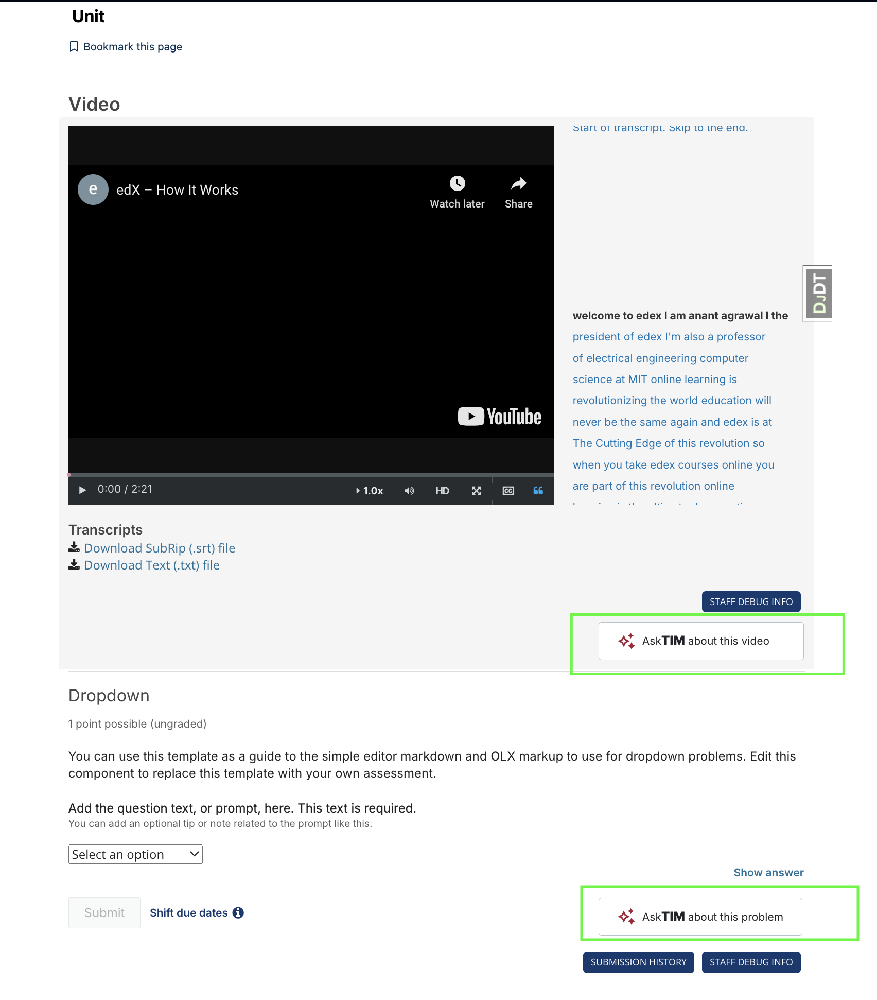

OL Open edX Chat
###############

An xBlock aside to add MIT Open Learning chat into xBlocks.

Purpose
*******

MIT's AI chatbot for Open edX

Setup
=====

For detailed installation instructions, please refer to the `plugin installation guide <../../docs#installation-guide>`_.

Installation required in:

* LMS
* Studio (CMS)

Configuration
=============

1. edx-platform configuration
-----------------------------

- Add the following configuration values to the config file in Open edX. For any release after Juniper, that config file is ``/edx/etc/lms.yml``. If you're using ``private.py``, add these values to ``lms/envs/private.py``. These should be added to the top level. **Ask a fellow developer for these values.**

  .. code-block::

    MIT_LEARN_AI_API_URL: <MIT_LEARN_AI_API_URL>
    MIT_LEARN_API_BASE_URL: <MIT_LEARN_API_BASE_URL>
    MIT_LEARN_SUMMARY_FLASHCARD_URL: <MIT_LEARN_SUMMARY_FLASHCARD_URL>

- For Tutor installations, these values can also be managed through a `custom Tutor plugin <https://docs.tutor.edly.io/tutorials/plugin.html#plugin-development-tutorial>`_.

2. Add database record
----------------------

- Create a record for the ``XBlockAsidesConfig`` model (LMS admin URL: ``/admin/lms_xblock/xblockasidesconfig/``).

- Create a record in the ``StudioConfig`` model (CMS admin URL: ``/admin/xblock_config/studioconfig/``).

3. In frontend-app-learning, Run the below in the shell inside the learning MFE folder:
---------------------------------------------------------------------------------------
This will generate a bundle for the remoteAiChatDrawer. This bundle will be used in the learning MFE to render the chat drawer.

.. code-block:: sh

   npm pack @mitodl/smoot-design@^6.0.0
   tar -xvzf mitodl-smoot-design*.tgz
   mv package mitodl-smoot-design

4. Create env.config.jsx in the frontend-app-learning and add the below code:
-----------------------------------------------------------------------------
The Unit is rendered inside an Iframe and we use postMessage to communicate between the Iframe and the parent window. The below code is used to initialize the remoteAiChatDrawer.

.. code-block:: js

   import { getConfig } from '@edx/frontend-platform';

   import * as remoteTutorDrawer from "./mitodl-smoot-design/dist/bundles/remoteTutorDrawer.umd.js";

   remoteTutorDrawer.init({
       messageOrigin: getConfig().LMS_BASE_URL,
       transformBody: messages => ({ message: messages[messages.length - 1].content }),
   })

    const config = {
    ...process.env,
    };

   export default config;

5. Start learning MFE by ``npm run dev``
----------------------------------------
6. In LMS, enable the ``ol_openedx_chat.ol_openedx_chat_enabled`` waffle flag at ``<LMS>/admin/waffle/flag/``
-------------------------------------------------------------------------------------------------------------
This will enable the ol_openedx_chat plugin for all courses. You can disable it and add a ``Waffle Flag Course Override`` at ``/admin/waffle_utils/waffleflagcourseoverridemodel/`` to enable it for a single course.

7. Go to any course in CMS > Settings > Advanced Settings and add the below in "Other Course Settings"
------------------------------------------------------------------------------------------------------
.. code-block::

   {"OL_OPENEDX_CHAT_VIDEO_BLOCK_ENABLED": true, "OL_OPENEDX_CHAT_PROBLEM_BLOCK_ENABLED": true}

* ``OL_OPENEDX_CHAT_VIDEO_BLOCK_ENABLED`` is used to enable/disable the VideoGPT for all videos.
* ``OL_OPENEDX_CHAT_PROBLEM_BLOCK_ENABLED`` is used to enable/disable the AI Chat for all problems.
* Once, enabled, you will see a checkbox below problem and video blocks in CMS. It is enabled by default.

CMS View

* You will also see a Chat Button titled "AskTIM about this video/problem" in the LMS. Now AI Chat/VideoGPT is enabled for all videos and problems.

LMS View with AskTIM button

LMS Chat Drawer View

9. Disable it for a single block
--------------------------------
If you want to disable it for a few videos/problems then you disable the ``Enable AI Chat Assistant`` checkbox against the block in CMS.

Documentation
=============

License
*******

The code in this repository is licensed under the AGPL 3.0 unless
otherwise noted.

Please see `LICENSE.txt <LICENSE.txt>`_ for details.
