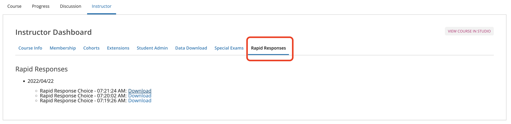

Rapid Response xBlock
=====================

A django app plugin for edx-platform

Setup
-----

1) Add rapid response as a dependency
~~~~~~~~~~~~~~~~~~~~~~~~~~~~~~~~~~~~~

In production, the current practice as of 01/2021 is to add this
dependency via Salt.

For detailed installation instructions, please refer to the `plugin installation guide <../../docs#installation-guide>`_.

Installation required in:

* LMS
* Studio (CMS)

2) Update edX config files
~~~~~~~~~~~~~~~~~~~~~~~~~~

`odl_devstack_tools <https://github.com/mitodl/odl_devstack_tools>`__
can be used to automatically apply the necessary config changes when you
start the containers. If you’re not using that tool, you can manually
add/edit the relevant config files while running bash in the LMS
container (``make dev.shell.lms``):

Juniper release or more recent
^^^^^^^^^^^^^^^^^^^^^^^^^^^^^^

If you’re using any release from Juniper onward, make sure the following property exists with the given value in ``/edx/etc/lms.yml`` and
``/edx/etc/studio.yml``. If you're using ``private.py``, add these values to ``lms/envs/private.py`` and ``cms/envs/private.py``:

.. code:: yaml

   - ALLOW_ALL_ADVANCED_COMPONENTS: true

Any release before Juniper
^^^^^^^^^^^^^^^^^^^^^^^^^^

If you’re using any release before Juniper, make sure the following
properties exist with the given values in
``/edx/app/edxapp/lms.env.json`` and ``/edx/app/edxapp/cms.env.json``:

.. code:: json

   {
       "ALLOW_ALL_ADVANCED_COMPONENTS": true,
       "ADDL_INSTALLED_APPS": ["rapid_response_xblock"]
   }

``ADDL_INSTALLED_APPS`` may include other items. The list just needs to
have ``rapid_response_xblock`` among its values.

Feature flags
^^^^^^^^^^^^^

There is a feature flag to enable toggling the rapid response
functionality for a problem through course outline in CMS. Enable
``ENABLE_RAPID_RESPONSE_AUTHOR_VIEW`` in your CMS config either through
``/edx/app/edxapp/cms.env.json`` or ``private.py``.

.. code:: yaml

   - ENABLE_RAPID_RESPONSE_AUTHOR_VIEW: true or false

NOTE: Once this flag is enabled and you toggle the rapid response
from course outline, It will auto publish the problem if it was not in
draft.

For Tutor installations, these values can also be managed through a `custom tutor plugin <https://docs.tutor.edly.io/tutorials/plugin.html#plugin-development-tutorial>`_.

3) Add database record
~~~~~~~~~~~~~~~~~~~~~~

If one doesn’t already exist, create a record for the
``XBlockAsidesConfig`` model (LMS admin URL:
``/admin/lms_xblock/xblockasidesconfig/``).

If you have enabled ``ENABLE_RAPID_RESPONSE_AUTHOR_VIEW`` you will also
need to create a record in the ``StudioConfig`` model (CMS admin URL:
``/admin/xblock_config/studioconfig/``).

4) Rapid Response for Studio and XML
~~~~~~~~~~~~~~~~~~~~~~~~~~~~~~~~~~~~

`Studio
Documentation <https://odl.zendesk.com/hc/en-us/articles/360007744011-Rapid-Response-for-Studio>`__
`XML
Documentation <https://odl.zendesk.com/hc/en-us/articles/360007744151-Rapid-Response-for-XML>`__

Database Migrations
-------------------

If your ``rapid-response-xblock`` repo is mounted into the devstack
container, you can create migrations for any model changes as follows:

::

   # From the devstack directory, run bash in a running LMS container...
   make dev.shell.lms

   # In bash, create the migrations via management command...
   python manage.py lms makemigrations rapid_response_xblock --settings=devstack_docker

Usage
-----

*NOTE (4/2021)*: Rapid response is **only configured to work with
multiple choice problems**.

Follow these steps to enable an individual problem for rapid response:
1. Load the problem in Studio 2. Click “Edit” 3. In the editing dialog
UI there should be Editor, Settings, and Plugins in the title bar. Click
“Plugins”. (If this option doesn’t exist, rapid response may not be
properly configured) 4. Check the box (“Enable problem for
rapid-response”) 5. Save and publish

When you navigate to that problem in LMS, you should now see an option
for opening the problem for rapid response.

To test rapid response functionality: 1. Login to your local edX
instance as “staff” 2. In Studio go to the edX Demo Course. Create a new
unit which is a multiple choice problem. 3. Edit the problem and turn on
rapid response as described in the previous steps. 4. Publish and click
“View Live Version” 5. Verify that the dropdown next to “View this
course as” is “Staff”. 6. Scroll down and you should see an empty graph
containing a button labeled “Open problem now”. Click on the button and
it should show a timer that starts counting. 7. Pick one of the answers
and submit it. After a few seconds a bar should appear for the column
for the answer. 8. Pick another answer, and the bar should disappear and
a new one should appear at the new answer. 9. Click “Close problem now”
10. Click the dropdown next to “View this course as” to switch to
“Audit”. You should see a multiple choice question with two incorrect
answers and one correct answer according to the labels. You should
**not** see the rapid response functionality beneath the problem.

Rapid Response Reports
----------------------

All the results of the Rapid Response problems are also available in
form of CSV reports as a separate plugin
`ol-openedx-rapid-response-reports <https://github.com/mitodl/open-edx-plugins/tree/main/src/ol_openedx_rapid_response_reports>`__.
(*Installation instructions are on the given link*).

**How/Where to check reports?**

After you’ve installed
`ol-openedx-rapid-response-reports <https://github.com/mitodl/open-edx-plugins/tree/main/src/ol_openedx_rapid_response_reports>`__,
visit ``Rapid Responses`` under the ``Instructor Dashboard``. If you
don’t see ``Rapid Responses`` tab, please check that the plugins is
installed properly. |Screenshot of Rapid Response reports|

**NOTE:** Rapid Response xBlock works independently and doesn’t depend
on ``ol-openedx-rapid-response-reports``, there are no additional steps
to be performed inside Rapid Response xBlock if you want to use the
reports plugin.

